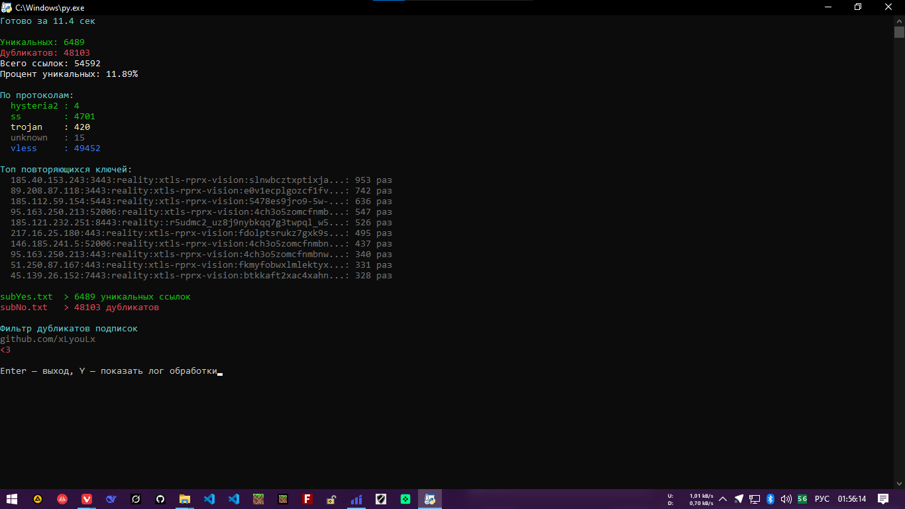

# Filter-duplicates-key

Фильтрует дубликаты в подписках VLESS / VMess / Trojan / Shadowsocks / Hysteria.  
Оставляет только уникальные конфиги, даже если UUID разные.

## Что делает

- Берёт **все .txt** из папки `sub/`
- Парсит каждую ссылку (vless://, vmess://, trojan://, ss://, hy://)
- Строит **уникальный ключ** без учёта UUID/пароля:
  - для **vless** → server:port:security:flow + (pbk|sid|sni для reality)
  - для **vmess** → server:port:uuid:security:net + host/path если есть
  - для **trojan** → server:port:password:security + host/path/sni
  - для **ss** → server:port:method:password
  - для **hysteria** → server:port:auth
- Если ключ уже был → кидает в дубликаты
- Уникальные → в `subYes.txt`
- Дубли → в `subNo.txt`
- Показывает цветной лог в реальном времени + красивую статистику в конце
- Считает протоколы, топ повторяющихся ключей, процент уникальности
